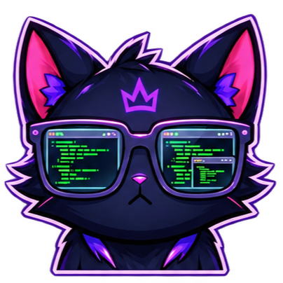
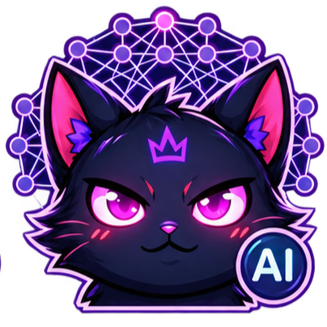
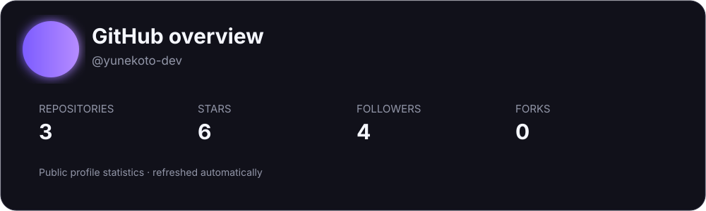
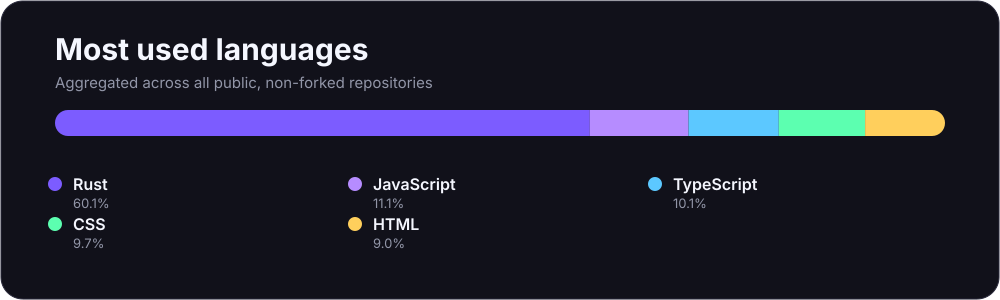
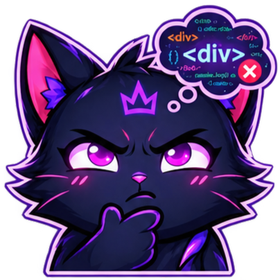
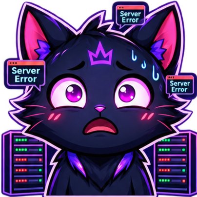
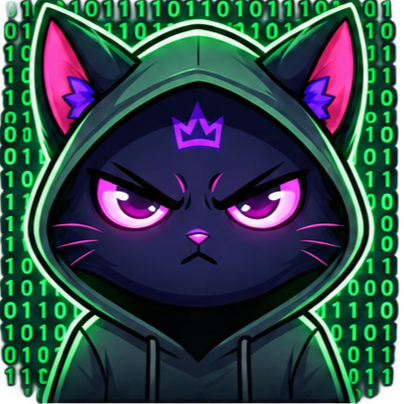

<div align="center">


### Developer · Creator · Builder

**Build what you wish already existed.**

<br>


&nbsp;&nbsp;&nbsp;&nbsp;


<br>

</div>

---

## `01` — About me

I'm a passionate, project-oriented developer who enjoys exploring almost every layer of software.

I like turning ideas into concrete tools, experimenting with unfamiliar technologies, and pushing projects as far as I can.

When I catch myself thinking "this could have been done differently", I would rather try to build it myself.


I'm especially interested in projects where I can combine **creativity, engineering and experimentation** — from polished web applications to low-level software.

---

## `02` — Tech stack

<div align="center">


**Languages**

[](https://www.rust-lang.org/)
[](https://en.cppreference.com/w/c)
[](https://www.java.com/)
[](https://developer.mozilla.org/docs/Web/JavaScript)
[](https://www.typescriptlang.org/)
[](https://www.python.org/)
[](https://www.php.net/)
[](https://developer.mozilla.org/docs/Web/HTML)
[](https://developer.mozilla.org/docs/Web/CSS)

**Web / Applications**

[](https://nodejs.org/)
[](https://react.dev/)
[](https://vuejs.org/)
[](https://www.electronjs.org/)
[](https://firebase.google.com/)
[](https://supabase.com/)

**Systems / Tooling**

[](https://www.linux.org/)
[](https://www.docker.com/)
[](https://git-scm.com/)
[](https://code.visualstudio.com/)
[](https://restfulapi.net/)
[](https://developer.mozilla.org/docs/Web/API/WebSockets_API)

</div>

> I deliberately keep a broad stack. I like learning a technology by actually building something with it.

---

## `03` — Currently exploring

<table>
<tr>
<td width="120" valign="top">

</td>
<td valign="top">

- Systems programming & emulation
- Advanced Rust
- Modern web architecture
- Software architecture & tooling

</td>
</tr>
</table>

---

## `04` — GitHub

<div align="center">



<br>



<br>


</div>

> The overview and language cards above are generated in-house from `src/generators/` on every workflow run, so they never depend on a third-party server being up. The streak card is powered by the community [github-readme-streak-stats](https://github.com/DenverCoder1/github-readme-streak-stats) project — if it ever stops loading, remove that `` line; the two in-house cards above are unaffected. (We dropped the old `github-readme-stats.vercel.app` badge — its public demo server is frequently rate-limited/down, which is why it wasn't showing up.)

---

## `05` — Contact

<div align="center">

[](mailto:yunekoto@proton.me)
<br>
[](https://github.com/yunekoto-dev)
<br>
[](https://tinyurl.com/yunekoto-discord)

</div>

> Update `config/profile.ts` → `contacts` with your real email and links (website, X/Twitter, LinkedIn, etc.) — they'll be picked up automatically here. Badge colors follow each platform's brand color, so feel free to swap in others (e.g. `1DA1F2` for X/Twitter, `0A66C2` for LinkedIn) as you add them.

---

## `06` — Featured projects

### GameBoy / GameBoy Color / GameBoy Advance Emulator
A Rust-based multi-system emulator currently under development.

**In development** · `Rust` · `Emulation` · `Low-level` · `Systems`


### Project pipeline

- **PROJECT_02** — Your next project goes here. · *Coming soon*
- **PROJECT_03** — A future project to be showcased here. · *Coming soon*

As new projects become public, they can be added to `config/projects.ts` and automatically surfaced here.

---

## `07` — Engineering mindset

<table>
<tr>
<td valign="top">

```text
idea
 │
 ├── explore
 │
 ├── prototype
 │
 ├── break things
 │
 ├── understand why
 │
 ├── rebuild
 │
 └── ship
```

I don't want to only consume software.

I want to understand it, modify it, and build the things I wish existed.

</td>
<td width="120" valign="top" align="center">

</td>
</tr>
</table>

---

## `08` — Profile infrastructure

<table>
<tr>
<td width="120" valign="top">

</td>
<td valign="top">

This profile is itself a small automated project.

```text
GitHub API ──> Data collector ──> SVG generators ──> README
                                        │
                                        └──> GitHub Actions
```

The repository uses:

- TypeScript
- Node.js
- GitHub Actions
- GitHub REST API
- generated SVG components (stats + language breakdown)
- cached/fallback data handling
- configurable project & contact metadata

</td>
</tr>
</table>

---

<div align="center">



### `YUNEKOTO // BUILD • EXPLORE • CREATE`

<sub>Profile data is automatically refreshed by GitHub Actions.</sub>

<br><br>


</div>
